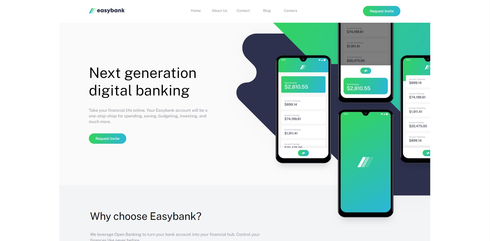

# Frontend Mentor - Easybank landing page solution

This is a solution to the [Easybank landing page challenge on Frontend Mentor](https://www.frontendmentor.io/challenges/easybank-landing-page-WaUhkoDN). Frontend Mentor challenges help you improve your coding skills by building realistic projects. 

## Table of contents

- [Overview](#overview)
  - [The challenge](#the-challenge)
  - [Screenshot](#screenshot)
  - [Links](#links)
- [My process](#my-process)
  - [Built with](#built-with)
  - [What I learned](#what-i-learned)
  - [Continued development](#continued-development)

## Overview

### The challenge

Users should be able to:

- View the optimal layout for the site depending on their device's screen size (desktop: 1440px/mobile:375px)
- See hover states for all interactive elements on the page

### Screenshot

### Links

- Solution URL: [https://github.com/effzedwhy/Easybank] (https://www.github.com/effzedwhy/Easybank)
- Live Site URL: [https://effzedwhy.github.io/Easybank/] (https://effzedwhy.github.io/Easybank/)

## My process

### Built with

- Semantic HTML5 markup
- CSS custom properties
- Flexbox
- Mobile-responsive (375px)

### What I learned

I learned the following:

- attention to detail to make sure my design was as accurate as possible to the given image (without figma files)
- how to use trasform and object positioning in relation to cropping and displaying one section of an image
- to keep going when things got a little hard!

### Continued development

- mobile-first approach
- refine & refractor my code
- use a UI library
- try out a more advanced design challenge
